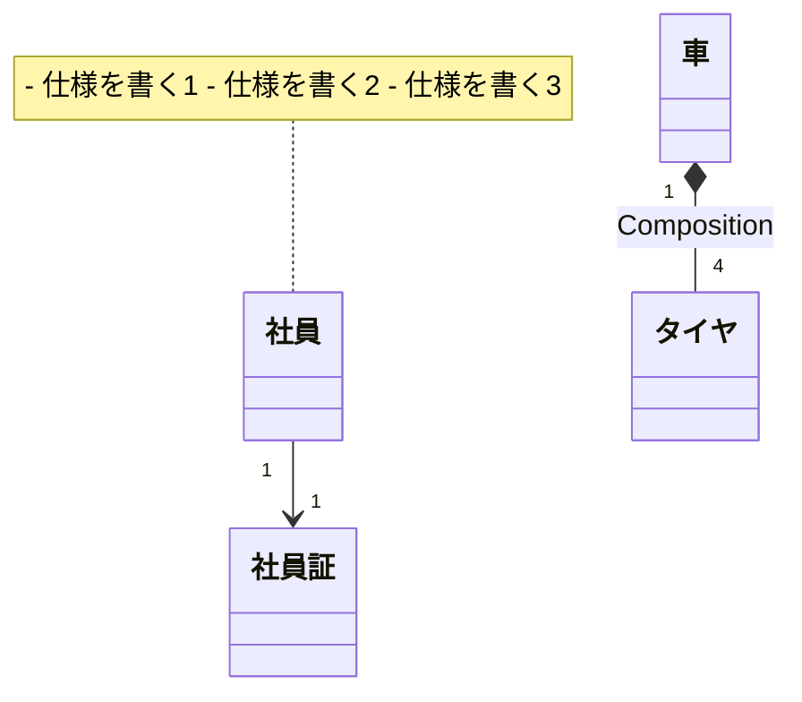

## ドメインモデリング
### モデルの定義
- 問題解決のために、物事の特定の側面を抽象化したもの
- 現実世界をそのままソフトウェアにすることはできないため、問題解決に適した形で抽象化する必要があり、その成果物がモデル

### ドメインモデリングはなぜ必要か
- **ビジネスサイドとエンジニアが共通認識を持ち、意思疎通する**ため
  - 共通言語(ユビキタス言語)を決め、言語のゆらぎをなくす
- 業務知識を設計に反映させることで、より業務に適した設計を作成するため
  - どんな問題を解決するかを明確にしてモデル図に反映させる
- ビジネスサイドがドメインモデルを通して、プロダクトの技術面を理解することができる
  - 大幅な変更があったとき、ビジネスサイドに対してドメインモデルを通して負債解消等に理解を得られる

### ドメインモデル図の作成方法
- オブジェクトどうしの関連を示す
  - 例. 社員が社員証を持っている、という関係を表現
- コンポジションの関係を示す
  - 例.
- 多重度を定義する
- 仕様を吹き出しに記載する

### 参考資料
- 「モデリングから利益を得る」とは
  - https://qiita.com/little_hand_s/items/721afcbc555444663247#%E3%83%A2%E3%83%87%E3%83%AA%E3%83%B3%E3%82%B0%E3%81%8B%E3%82%89%E5%88%A9%E7%9B%8A%E3%82%92%E5%BE%97%E3%82%8B%E3%81%A8%E3%81%AF
- 【DDD】1年やってみてわかったドメインモデリングの型
  - DDDの型がとても具体的に記載されていてとてもわかりやすかった
  - https://zenn.dev/innoscouter/articles/b1973a7032ff8a
- ドメインモデル図を描く手順
  - 名刺の抽出がわかりやすかった
    > 名詞は「ドメインクラス、ドメインクラスの属性、アクタ」の３種類に分けられ、判別方法は下記のようになる。アクタ: ユーザや外部システム、ドメインクラスの属性: 商品の型番や値段など、○○の△△という形で書けるもの、ドメインクラス: 上記以外の名詞
  - https://www.eureka-moments-blog.com/entry/2018/12/29/145802
- ドメインモデリングをするときに気をつけていること
  - https://zenn.dev/m10maeda/articles/what-to-bear-in-mind-when-domain-modeling

